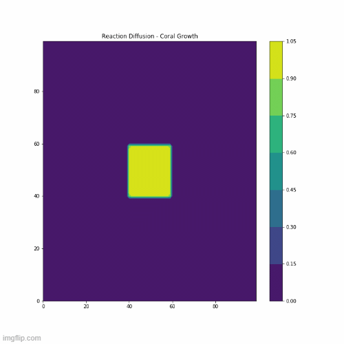
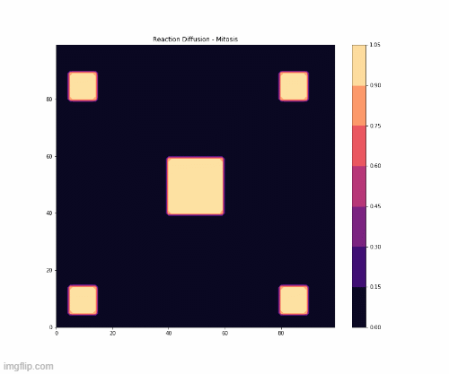
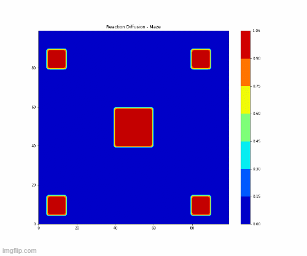
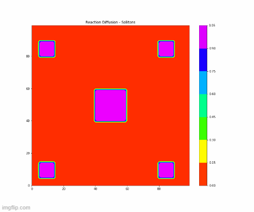

# Reaction Diffusion Simulation

This repository contains a Python3 implementation of the reaction-diffusion simulation. You can learn more about the nature of the simulation from [karlsim's tutorial](https://www.karlsims.com/rd.html). I referred to [this repository](https://github.com/IZ-sandwich/PhysHackNov7) for creating the animation for the simulation. 

<code> reac-diff.py</code> contains an implementation of the code along with the animation.

<code> Reaction-Diffusion-no-Animation.ipynb</code> contains an implementation of the code without the animation function, but simply outputs the plot every 10 iterations. The images can then be stitched together to form a GIF/video. 

### Dependencies 

The code requires the following dependencies:

* <code> Numpy </code>
* <code> Matplotlib </code>
* <code> Scipy </code>
* <code> ffmpeg</code> or <code> Pillow</code> for the animation

### Examples

Based on the feed and kill rate values, different patterns emerge in the simulations. Some outputs are shown here:

* Coral Growth

* Mitosis

* Maze

* Solitons

These outputs are in the <code>outputs</code> folder and the corresponding initial conditions are listed in the <code>Initial Conditions</code> folder. 

### License

This code is licensed by the GNU General Public License v3.0. You can read more about it [here](https://github.com/drkndl/Reaction-Diffusion/blob/main/LICENSE).
